<div align="center">

# Tasbeeh Smartwatch

**A small, fully offline remembrance (dhikr) counter watch for kids — an ESP32-S3 with a 1.28″ round touchscreen.**

<p>
  
  
  
  
  
</p>

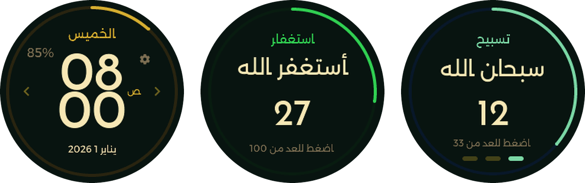

### [▶ Try it live in your browser — no install, nothing uploaded](https://abda-s.github.io/tasbeeh-watch/)

The real firmware, compiled to WebAssembly. Tap it, swipe it, fire a reminder — right on this page.

<p>
  <a href="#about">About</a> ·
  <a href="#features">Features</a> ·
  <a href="#screenshots">Screenshots</a> ·
  <a href="#quick-start">Quick start</a> ·
  <a href="#power-profiler">Power profiler</a> ·
  <a href="#documentation">Documentation</a> ·
  <a href="#roadmap">Roadmap</a>
</p>

</div>

---

## About

<table>
  <tr>
    <td valign="top">

Firmware for the [Waveshare ESP32-S3-Touch-LCD-1.28](https://www.waveshare.com/esp32-s3-touch-lcd-1.28.htm):
a round-screen offline dhikr counter for kids. Tells time, counts *istighfar* and *tasbeeh* by tap, and
reminds on daily routines (water, handwashing, homework, teeth, bedtime) with a popup and optional vibration.

- **Not a prayer app.** No prayer times, adhan or Qibla — only what's listed under [Features](#features).
- **Offline.** No WiFi, Bluetooth, phone app or cloud. Everything lives in the watch's own flash.
- **Arabic UI**, right-to-left.
- **Clock set by hand** (Settings), kept by the chip's internal oscillator — no network time, no RTC
  battery, so it drifts slowly.

</td>
    <td align="center" width="270">
      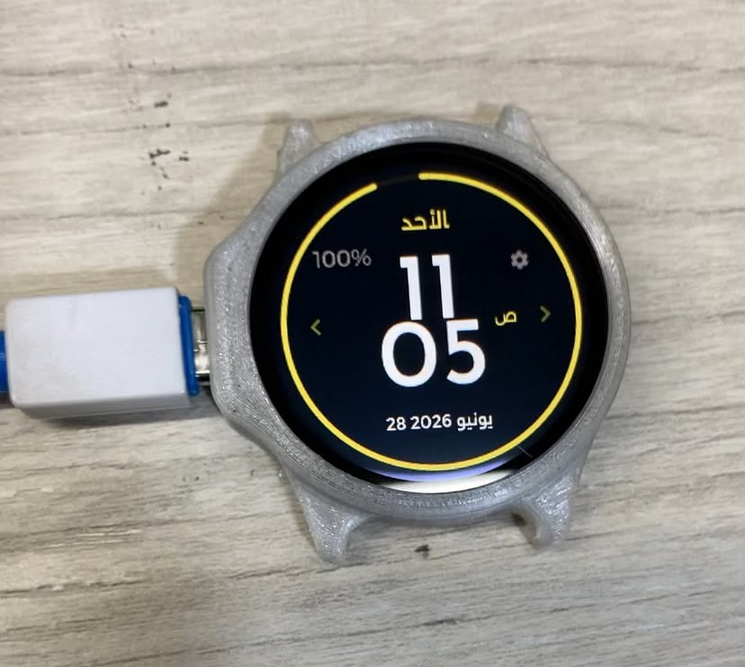<br>
      <sub>On the real board, in a 3D-printed case.</sub>
    </td>
  </tr>
</table>

## Features

- **Round 240×240 UI**, three-screen swipe ring: Home ↔ Istighfar ↔ Tasbeeh.
- **Clock** — 12h time, seconds arc, day, date, battery %.
- **Istighfar counter** — tap to count 0 → 100.
- **Tasbeeh counter** — 3 phrases (سبحان الله / الحمد لله / الله أكبر) × 33, progress dots, persists across reboots.
- **Settings** — set the time, manage notifications.
- **5 preset reminders** — per-reminder on/off, time, days, popup, optional vibration.
- **Power management** — display sleep, real light sleep, deep sleep, and a <5% battery lockdown (this
  board has no hardware over-discharge protection).
- **Two simulators** — a [live browser demo](https://abda-s.github.io/tasbeeh-watch/) (WebAssembly,
  no install) and a [local dev version](sim/README.md) with a scriptable control panel. No board needed
  for either.

## Screenshots

Captured from the [desktop simulator](sim/README.md) — the real firmware, running unmodified.

<table>
  <tr>
    <td align="center">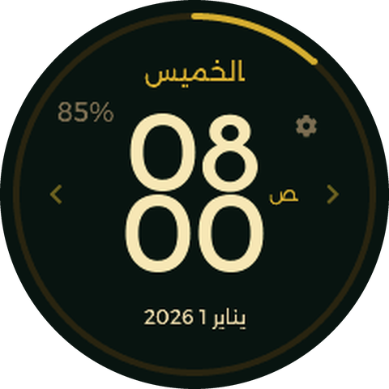<br><sub><b>Home</b></sub></td>
    <td align="center">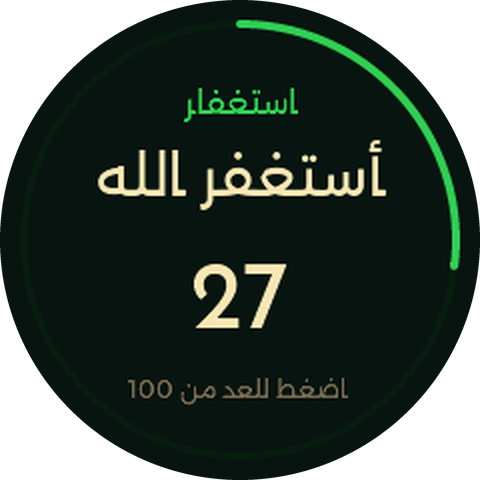<br><sub><b>Istighfar</b></sub></td>
    <td align="center">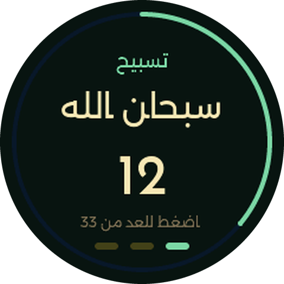<br><sub><b>Tasbeeh</b></sub></td>
  </tr>
  <tr>
    <td align="center">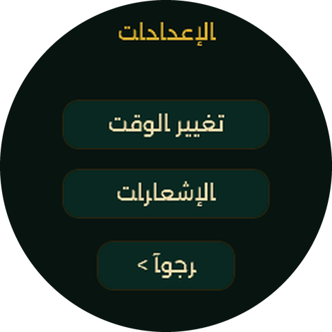<br><sub><b>Settings</b></sub></td>
    <td align="center">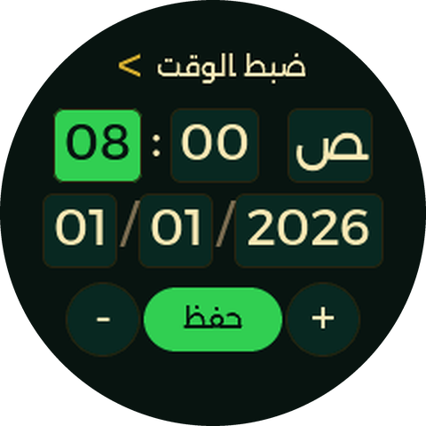<br><sub><b>Set time</b></sub></td>
    <td align="center"><br><sub><b>Notifications</b></sub></td>
  </tr>
  <tr>
    <td align="center"><br><sub><b>Reminder editor</b></sub></td>
    <td align="center"><br><sub><b>Reminder popup</b></sub></td>
    <td align="center">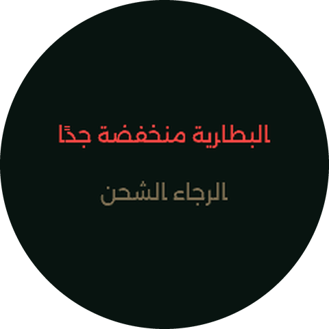<br><sub><b>Battery lockdown</b> (&lt;5%)</sub></td>
  </tr>
</table>

## Quick start

**Requirements:** [PlatformIO](https://platformio.org/) and, for the real watch, a
Waveshare ESP32-S3-Touch-LCD-1.28 board.

### Build and flash

```bash
pio run                                                        # build
pio run --target upload --upload-port /dev/ttyUSB0            # flash
pio device monitor --port /dev/ttyUSB0 --baud 115200          # serial log
```

If the board isn't detected, enter download mode first: hold **BOOT**, press **RESET**, release **BOOT**.

### Try it without hardware

**No install:** [abda-s.github.io/tasbeeh-watch](https://abda-s.github.io/tasbeeh-watch/) —
the same firmware, compiled to WebAssembly, running in the page. See [`docs/README.md`](docs/README.md).

**Local dev version**, with a scriptable HTTP control panel for testing (battery slider, reminders,
sleep/wake, vibration visualizer):

```bash
./sim/run.sh          # then open http://localhost:8080
```

Needs `g++` and PlatformIO. See [`sim/README.md`](sim/README.md).

## Hardware

| | |
|---|---|
| **Board** | Waveshare ESP32-S3-Touch-LCD-1.28 |
| **MCU** | ESP32-S3 — 240 MHz capable, runs at 80 MHz awake; 320 KB SRAM, 16 MB flash, 2 MB PSRAM |
| **Display** | 1.28″ round TFT, 240×240, GC9A01 over SPI (40 MHz) |
| **Touch** | CST816S capacitive, I²C |
| **Power** | Li-ion cell with an ETA6098 charger; battery level read through a voltage divider on GPIO1 |
| **Vibration** | Optional motor on a free GPIO (`VIBRATOR_PIN`), switchable in the app |

More in [Hardware](documentation/hardware.md); component datasheets are in [`datasheets/`](datasheets/).

## Power profiler

Battery numbers here are measured, not estimated, with a small INA226-based profiler kept in
[`power_profiler/`](power_profiler/README.md). It found the real battery capacity to be **~48 mAh**, not
the advertised 100 mAh.

<table>
  <tr>
    <td width="270">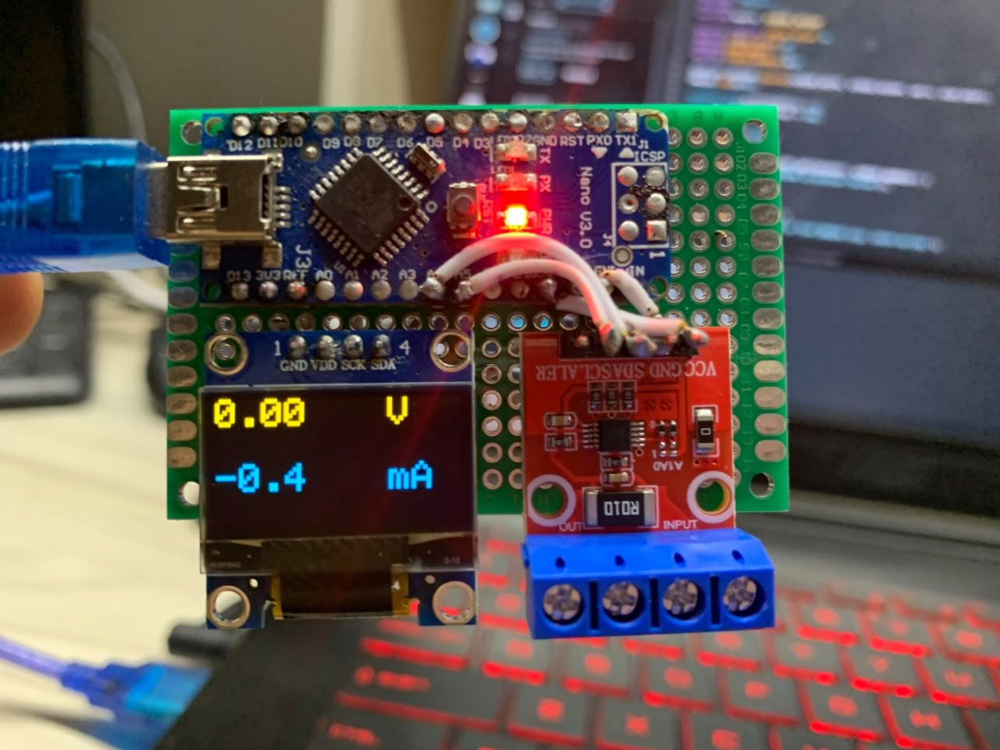</td>
    <td valign="top">

- **Sensor:** INA226 (10 mΩ shunt) in series with the watch's supply, read by an Arduino Nano over I²C,
  streamed over USB serial. Sketch: [`ina226_timed.ino`](power_profiler/firmware/ina226_timed.ino).
- **OLED:** live volts/mA readout, so the module also works as a standalone meter.
- **App:** PyQt5/pyqtgraph oscilloscope-style current/voltage plot, ROI charge/energy readout,
  battery-life estimate, duty-cycle analysis from the firmware's `[SLEEP]`/`[WAKE]` log markers, CSV
  export. Full list: [profiler README](power_profiler/README.md).

</td>
  </tr>
</table>

### Measured

| Version | Change | Screen | Avg current |
|---|---|---|---|
| V1 | Baseline, WiFi connected | off / on | 51 mA / 90 mA |
| V1.1 | WiFi removed | off / on | 35 mA / 85 mA |
| V1.2 | 80 MHz during sleep, touch standby, PWM backlight | off / on | 29 mA / 70 mA |
| V1.21 | Static swipe arrows, 160 MHz awake, adaptive loop | off / on | 28 mA / 48 mA |
| V1.22 | 80 MHz awake | on | 43 mA |
| V1.3 | Real light sleep | off (asleep) | **~5 mA** |
| V1.5 | Deep sleep (lockdown mode) | asleep | **~0.7 mA** |

Full reasoning per version: [Power Management](documentation/power-management.md).

<table>
  <tr>
    <td align="center">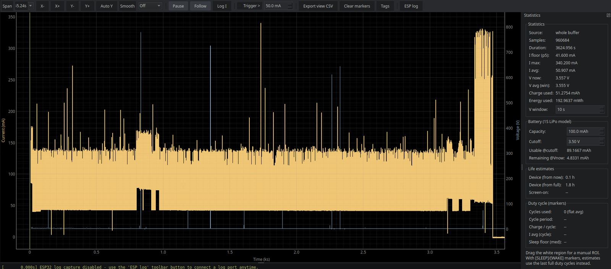<br><sub>V1 · screen off — 51 mA</sub></td>
    <td align="center">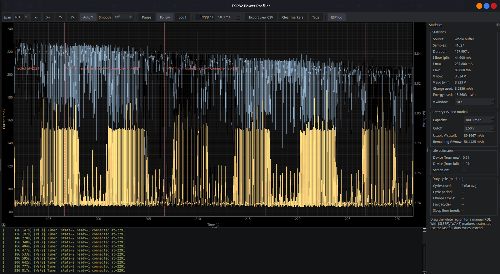<br><sub>V1 · screen on — 90 mA</sub></td>
  </tr>
  <tr>
    <td align="center">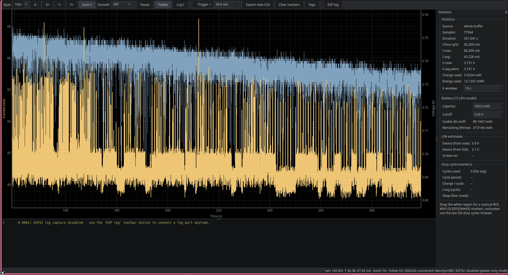<br><sub>V1.22 · screen on — 43 mA</sub></td>
    <td align="center">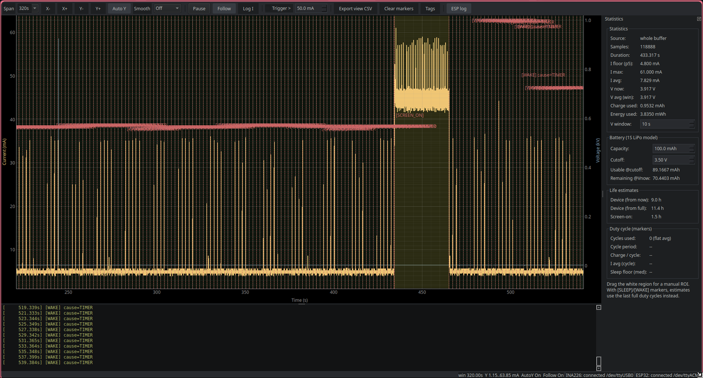<br><sub>V1.3 · light sleep — ~5 mA floor</sub></td>
  </tr>
</table>

### Try it

```bash
cd power_profiler
python3 -m venv .venv && source .venv/bin/activate
pip install -r requirements.txt
python profiler.py --demo        # synthetic data, no hardware needed
python profiler.py               # pick the INA226 (and optionally ESP32 log) port
```

## Repository layout

```
├── src/                  Firmware — main.cpp, ui/ (screens), config/, generated fonts
├── sim/                  Desktop simulator (mock hardware layer + browser front-end)
├── docs/                 Browser simulator — same firmware compiled to WebAssembly, hosted on GitHub Pages
├── documentation/        Technical documentation and screenshots
├── datasheets/           Schematic and component datasheets
├── power_profiler/       INA226 power profiler — desktop app, sensor firmware, captured logs
├── scripts/              Helper scripts
├── boards/               Board definition and partition table
├── generate_fonts.sh     Font generation pipeline
├── remap_arabic.py       Adds Arabic presentation-form glyphs to modern fonts
└── platformio.ini        Build configuration (firmware + simulator environments)
```

## Documentation

Everything technical lives in [`documentation/`](documentation/README.md):

| Document | What's in it |
|---|---|
| [User Interface](documentation/user-interface.md) | Screens, gestures, navigation model, color palette, time editor |
| [Architecture](documentation/architecture.md) | Source layout, data persistence, rendering performance |
| [Reminders & Notifications](documentation/reminders-and-notifications.md) | Data model, the preset config table, UI, tap-target tuning |
| [Power Management](documentation/power-management.md) | Every optimization from V1 to V1.5, with measurements |
| [Deep Sleep & Battery Lockdown](documentation/deep-sleep-and-lockdown.md) | Deep sleep, timekeeping across it, the <5% lockdown mode |
| [Font System](documentation/fonts.md) | How Arabic text is shaped and how the fonts are generated |
| [Hardware](documentation/hardware.md) | Board, display, touch, battery and charger details |
| [Build & Configuration](documentation/build-and-configuration.md) | Building, dependencies, LVGL settings, library patches |
| [Simulator](sim/README.md) | How the desktop simulator works and what it fakes |
| [Browser Simulator](docs/README.md) | The WebAssembly build behind the live demo, and why it needed one |
| [Power Profiler](power_profiler/README.md) | The INA226 measurement rig and desktop app used for all the power numbers |

## Roadmap

- A brightness setting in the Settings screen.
- The 20% → 5% "power-saving" battery tier (deep sleep in place of light sleep, otherwise unchanged behavior) —
  only the <5% lockdown tier exists so far.

## Acknowledgements

Built on [LVGL](https://lvgl.io/), [TFT_eSPI](https://github.com/Bodmer/TFT_eSPI) and
[CST816S](https://github.com/fbiego/CST816S). Arabic text uses the Alexandria and Reem Kufi typefaces from
Google Fonts.
