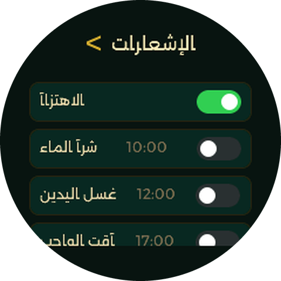
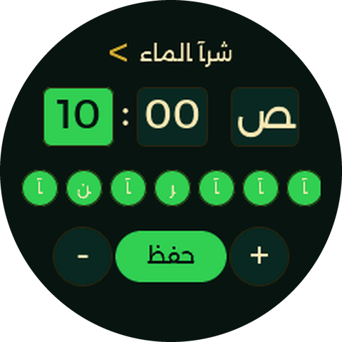
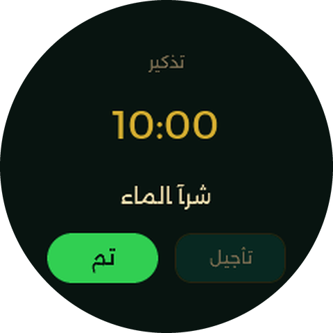

# Tasbeeh Smartwatch — ESP32-S3 Touch LCD 1.28

Islamic prayer counter smartwatch with clock, counters, and settings — built on
LVGL v9, TFT_eSPI, and the Waveshare ESP32-S3-Touch-LCD-1.28 round display.

---

## Screens

Captured from the [desktop simulator](sim/README.md) — the real firmware, running unmodified.

<table>
  <tr>
    <td align="center"><br><sub><b>Home</b><br>12h clock, seconds arc, battery</sub></td>
    <td align="center"><br><sub><b>Istighfar</b><br>tap to count, 0 → 100</sub></td>
    <td align="center"><br><sub><b>Tasbeeh</b><br>3 phrases × 33</sub></td>
  </tr>
  <tr>
    <td align="center"><br><sub><b>Settings</b></sub></td>
    <td align="center"><br><sub><b>Set time</b></sub></td>
    <td align="center"><br><sub><b>Notifications</b><br>preset reminders + vibration switch</sub></td>
  </tr>
  <tr>
    <td align="center"><br><sub><b>Reminder editor</b><br>time + repeat days</sub></td>
    <td align="center"><br><sub><b>Reminder popup</b><br>wakes the screen and vibrates</sub></td>
    <td align="center"><br><sub><b>Battery lockdown</b><br>&lt;5% — dim, dead end until charged</sub></td>
  </tr>
</table>

Layout sketch of the three main screens:

```
         HOME                          ISTIGHFAR                      TASBEEH
    ┌──────────────┐              ┌──────────────┐              ┌──────────────┐
    │ ◂   [⚙]     │              │   ╭─────╮    │              │   ╭─────╮    │
    │              │              │  ╱ green ╲   │              │  ╱  blue ╲   │
    │   السبت      │              │ │  arc    │  │              │ │  arc    │  │
    │    08        │              │  ╲       ╱   │              │  ╲       ╱   │
    │    30    م   │              │   ╰─────╯    │              │   ╰─────╯    │
    │              │              │              │              │              │
    │ 12 يناير 2026│              │   استغفار    │              │   تسبيح      │
    │              │              │              │              │              │
    │  85%         │              │ أستغفر الله  │              │ سبحان الله   │
    └──────────────┘              │              │              │              │
                                  │      0       │              │      0       │
    ◂ SWIPE ▸                     │              │              │              │
    arrows show                   │من 100·اضغط   │              │اضغط·من 33    │
    more screens                  └──────────────┘              │   ■ ■ ■      │
                                                               └──────────────┘
```

**3-screen ring:** Home ↔ Istighfar ↔ Tasbeeh (swipe left/right)
**Swipe arrows** (`◂` / `▸`) at screen edges indicate more screens (static — the
sway animation was removed in V1.21: it forced full-rate redraws forever and
measured ~10% of screen-on battery draw).
**Modals:** Settings (tap gear or swipe-down from home) → Change time / Notifications
entries inside it — swipe down or left to dismiss (Settings: tap the title to go back
too; TimeEdit/Notifications: tap `<` or the title).

### Screen accent colors

| Screen | Color | Hex | Arc / Title |
|--------|-------|-----|-------------|
| Home | Gold | `#d4af37` | Seconds arc, day name, AM/PM |
| Istighfar | Green | `#33cc55` | Progress arc, title |
| Tasbeeh | Blue | `#7fd6a3` / `#3b82f6` | Progress arc, title, dots |

### Gesture Map

- **Ring screens**: Swipe L/R = navigate ring, swipe **down** (home only) = settings
- **Settings**: tap **تغيير الوقت** = time edit, tap **الإشعارات** = notifications list,
  tap title or `< رجوع` = back (long-press-the-clock was removed — Settings is now
  the only way in, see Reminders / Notifications below)
- **Modals**: Swipe down = back, swipe **left** = back (Settings/TimeEdit/Notifications:
  tap the title bar also goes back — Settings no longer dismisses on a random
  background tap, only the title, since that was misfiring when tapping an option
  near its edge)
- **Notifications list**: tap a row = edit its time/days, tap its switch = toggle
  enabled without navigating
- **Tasbeeh/Istighfar**: Tap anywhere = increment counter

---

## Desktop Simulator

Run the real UI on your computer without flashing — `./sim/run.sh`, then open
<http://localhost:8080>. It executes the actual firmware source on a mock hardware layer, with a browser
control panel (battery slider, reminders, sleep/wake, and a visualizer for the vibration motor).
See [`sim/README.md`](sim/README.md).

---

## Project Structure

```
src/
├── main.cpp                      # Hardware init, LVGL setup, timers, loop, battery
├── config/
│   ├── CST816S_pin_config.h      # Touch I2C pin definitions
│   ├── lv_conf.h                 # LVGL v9 build configuration
│   └── reminders_config.h        # Reminder presets table — edit here to add/remove/rename notifications
├── ui/
│   ├── screens.h                 # Public API — screen pointers, nav, fonts, helpers
│   ├── screens.cpp               # Global pointers + screens_init()
│   ├── styles.h / styles.cpp     # Color palette + style definitions
│   ├── nav.cpp                   # Ring navigation + modal push/pop + gesture handlers
│   ├── screen_base.cpp           # Shared helpers (make_screen_base, create_title, touch_debug)
│   ├── screen_home.cpp           # Clock screen: 12h stacked time + AM/PM, day, date, seconds arc, swipe arrows
│   ├── screen_istighfar.cpp      # Istighfar counter: tap to count, 0→100 green arc
│   ├── screen_tasbeeh.cpp        # Tasbeeh counter: 3 phrases × 33, blue arc, progress dots, phrase persists across boot
│   ├── screen_settings.cpp       # Settings: تغيير الوقت + الإشعارات entries, title-tap back
│   ├── screen_timeedit.cpp       # 12h time editor — dual mode: system clock (HH:MM AM/PM, DD/MM/YYYY) or a reminder (HH:MM AM/PM + day-of-week toggles)
│   ├── screen_notifications.cpp  # Scrollable list of reminder presets — enable switch + tap-to-edit
│   └── screen_lockdown.cpp       # Battery <5% lockdown message — outside the normal nav graph, see Battery Lockdown Mode below
├── font_reem_kufi_72.c           # Clock digits — Reem Kufi 72px 4bpp
├── font_reem_kufi_48.c           # Counter digits — Reem Kufi 48px 4bpp
├── font_alexandria_12.c          # Small labels, AM/PM — Alexandria 12px 2bpp
├── font_alexandria_16.c          # Titles, day names, hints, theme — Alexandria 16px 2bpp
└── font_alexandria_28.c          # Arabic phrases — Alexandria 28px 4bpp
```

---

## Font System — How It Works

### The Core Problem

LVGL's Arabic shaper (`LV_USE_ARABIC_PERSIAN_CHARS`) converts base Arabic letters
to **presentation forms** — contextual shapes for connected writing (initial,
medial, final, isolated). These presentation forms live at Unicode codepoints
U+FB50–U+FDFF (Presentation Forms-A) and U+FE70–U+FEFF (Presentation Forms-B).

```
                    LVGL Arabic Shaper
                         │
    "استغفار" ──────────► converts to presentation forms
                         │
                    U+FEB3 (seen init), U+FE98 (teh medi), ...
                         │
                    Looks up these codepoints in your font
                         │
              ┌──────────┴──────────┐
              │                     │
         Old fonts              Modern fonts
    (DejaVu,Traditional)    (Reem Kufi, Amiri, ALL Google Fonts)
              │                     │
    PF glyphs at U+FExx ✓    PF glyphs in GSUB tables ONLY ✗
              │                     │
         RENDERS ✓              EMPTY BOX ✗
```

**Modern TTF fonts** store contextual Arabic shapes in OpenType **GSUB substitution
tables**, not at Unicode codepoints. `lv_font_conv` extracts glyphs by
**codepoint only** — it cannot read GSUB tables. The shaper looks for U+FEA1
(beh initial form), the font has no glyph at that codepoint → empty box.

**Older fonts** (DejaVu, Traditional Arabic, several Microsoft fonts) explicitly
map presentation form glyphs to Unicode codepoints. They work out-of-the-box.

### The Fix: fonttools Remap

We wrote `remap_arabic.py` (at the project root). It uses Python's
[fonttools](https://github.com/fonttools/fonttools) library to read and modify
TTF cmap tables:

```
┌──────────────────────────────────────────────────────┐
│  remap_arabic.py                                      │
│                                                      │
│  1. Opens TTF with fonttools                         │
│  2. Reads all glyph names                            │
│     "behDotless-ar.init"  ──►  U+FE91 (beh init)    │
│     "lam-ar.medi"         ──►  U+FEE0 (lam medi)    │
│     "hah-ar.isol"         ──►  U+FEA1 (hah isol)    │
│  3. Adds 100+ cmap entries: codepoint → glyph name  │
│  4. Saves remapped TTF                               │
└──────────────────────────────────────────────────────┘
```

**Usage:**
```bash
pip install fonttools freetype-py
python3 remap_arabic.py Alexandria-Regular.ttf
# → Alexandria-Regular-remapped.ttf
```

### Full Pipeline: generate_fonts.sh

`generate_fonts.sh` at the project root automates the complete pipeline:

```bash
bash generate_fonts.sh Alexandria-Regular.ttf alexandria
```

This:
1. Runs `remap_arabic.py` on the TTF
2. Generates 3 LVGL font files at 12px, 16px, 28px
3. Fixes include paths for LVGL v9
4. Reports glyph counts and file sizes

### lv_font_conv Flags Explained

```bash
lv_font_conv --no-compress --format lvgl \
  --font remapped.ttf \
  --size 16 --bpp 2 \
  --range 0x0020-0x007F,0x0600-0x06FF,0xFB50-0xFDFF,0xFE70-0xFEFF \
  --symbols "$CTRL_CHARS" \
  -o font_output.c
```

| Flag | What it includes | Why |
|------|-----------------|-----|
| `0x0020-0x007F` | Full ASCII (A-Z, 0-9, punctuation, space) | Digits for counters, Latin for timeedit labels, separators |
| `0x0600-0x06FF` | Arabic base block (all letters ا-ي) | Base characters the Arabic shaper reads |
| `0xFB50-0xFDFF` | Presentation Forms-A | Contextual shapes the shaper LOOKS FOR after conversion |
| `0xFE70-0xFEFF` | Presentation Forms-B | More contextual shapes |
| `\u200c` | ZWJ (zero-width joiner) | LVGL's shaper inserts these control characters |
| `\u200d` | ZWNJ (zero-width non-joiner) | Same |
| `\u200b` | ZWSP (zero-width space) | Fallback invisible glyph |
| `\u00a0` | NBSP (non-breaking space) | Fallback invisible glyph |

### BPP Guide

| Size | Recommended BPP | Gray levels | File size per glyph (approx) |
|------|-----------------|-------------|------------------------------|
| ≤16px | 2bpp | 4 levels | 36-64 bytes |
| ≥28px | 4bpp | 16 levels | 392-2592 bytes |

- **2bpp**: Fine for small text. Saves 50% space vs 4bpp.
- **4bpp**: Smooth anti-aliased edges for larger sizes.

### Quick Test — Does a Font Work?

```bash
python3 -c "
import freetype
f = freetype.Face('YourFont.ttf')
for cp in [0xFE8D, 0xFE91, 0xFEA3, 0xFEB1, 0xFEDF]:
    print(f'U+{cp:04X}: {\"FOUND\" if f.get_char_index(cp) > 0 else \"MISSING\"}')"
```

| Result | Meaning |
|--------|---------|
| 5/5 FOUND | Font works with `lv_font_conv` as-is (DejaVu, Amiri) |
| 0/5 | Needs `remap_arabic.py` (Reem Kufi, Kufam, Aref Ruqaa) |
| 3-4/5 | Mostly works, remap fills gaps (Alexandria) |

### Integrating Into Code

```cpp
// 1. Declare the font (in your .cpp file or styles.h)
LV_FONT_DECLARE(font_alexandria_16);

// 2. Set it on a style
lv_style_set_text_font(&style_title, &font_alexandria_16);

// 3. Or set it directly on an object
lv_obj_set_style_text_font(my_label, &font_alexandria_16, 0);

// 4. Or as the theme default (in main.cpp setup)
lv_theme_t *th = lv_theme_default_init(disp,
    color_teal, color_gold, true, &font_alexandria_16);
```

### Project Fonts

The project uses **Alexandria** (Google Fonts, geometric Arabic sans-serif) as the
primary Arabic font, remapped via `remap_arabic.py` to add presentation form
codepoint mappings. Reem Kufi is used only for large display digits (clock and
counter numbers) where Arabic shaping is not needed.

| Font | Size | BPP | Glyphs | Used for |
|------|------|-----|--------|----------|
| Reem Kufi 72 | 72px | 4bpp | 11 | Clock time (stacked HH\nMM) |
| Reem Kufi 48 | 48px | 4bpp | 10 | Counter digits |
| Alexandria 28 | 28px | 4bpp | 370 | Arabic phrases, timeedit numbers |
| Alexandria 16 | 16px | 2bpp | 370 | Titles, day names, date, hints, theme default |
| Alexandria 12 | 12px | 2bpp | 370 | Small labels, AM/PM toggle |

---

## Navigation Architecture

### Ring (circular, swipe)

```
   ┌──────┐   swipe left    ┌───────────┐   swipe left    ┌──────────┐
   │ HOME │ ──────────────→ │ ISTIGHFAR │ ──────────────→ │ TASBEEH  │
   │      │ ←────────────── │           │ ←────────────── │          │
   └──────┘   swipe right   └───────────┘   swipe right   └──────────┘
```

3 screens in a circular buffer. `navigate_ring(+1)` and `navigate_ring(-1)` wrap
around with `% RING_LEN`. Swipe-left = next screen (MOVE_LEFT animation),
swipe-right = previous (MOVE_RIGHT animation).

### Modal (overlay, swipe-down/left to dismiss)

```
   ┌──────────┐   ┌───────────────┐   ┌──────────────┐
   │ SETTINGS │──►│ NOTIFICATIONS │──►│ TIMEEDIT     │
   │ ← gear/↓ │   │ ← تغيير الوقت │   │ (reminder    │
   │ tap title│   │ tap title/<   │   │  or clock    │
   │ or < back│   │ swipe ↓/← back│   │  mode)       │
   └──────────┘   └───────────────┘   │ tap </title  │
        │                             │ swipe ↓/← back│
        └────────────────────────────►└──────────────┘
              تغيير الوقت (clock mode)
```

`push_modal(dest)` remembers the current screen, slides modal up.
`pop_modal()` slides back down. Swipe-down, swipe-left, or the header bar dismiss.
Since `pop_modal()` just returns to whichever screen was active when it was pushed,
this chains correctly to any depth — Settings → Notifications → TimeEdit → back →
back → back all land where you'd expect.

Settings no longer dismisses on a random background tap (that was misfiring when a
tap near — but not quite on — an option button registered as "go back" instead);
only its title is a back target now. TimeEdit and Notifications both dismiss on a
background tap still, and on tapping their header (back arrow `<` or title) — that
header's *whole* row is now the click target, not just the tight glyph bounds of
the `<`/title text, which were too small to reliably hit.

### Safe event handling

Every button callback checks `lv_screen_active()` before acting — prevents
animation-race bugs where a tap during a 200ms transition lands on the wrong screen.

---

## Battery Monitoring

- **Pin**: GPIO1 (ADC1_CH0) via 200K + 100K voltage divider (ratio 3:1)
- **Method**: `analogReadMilliVolts()` — uses ESP32-S3 factory ADC calibration
- **Formula**: V_bat = V_adc × 3.0, mapped 3.5V→0% to 4.15V→100%
- **Update**: Every 5 seconds, displayed at top-left of home screen
- **Color**: Red below 20%, grey otherwise

---

## Tasbeeh Phrase Persistence

The tasbeeh counter remembers both the **count** and the **current phrase**
(سبحان الله / الحمد لله / الله أكبر) across reboots via NVS:

- `tasbeeh` key: count (uint32)
- `tasbeeh_phrase` key: phrase index (int, 0–2)

Saved when the phrase advances (at 33) and loaded on boot.

---

## Performance Optimizations

| Optimization | What | Where |
|---|---|---|
| Double buffering | 2× 57KB buffers (partial mode) — renders into buf2 while buf1 flushes | `main.cpp` |
| 40 MHz SPI | `SPI_FREQUENCY 40000000` in the TFT_eSPI setup header | `Setup302_...GC9A01.h` |
| `-O2` optimization | Compiler optimizes for speed not size | `platformio.ini` |
| Flush batching | SPI transaction stays open across dirty rectangles within a frame | `main.cpp` flush callback |
| Adaptive idle | `loop()` sleeps until LVGL's next scheduled timer (`lv_timer_handler()` return value) instead of a fixed short delay | `main.cpp` |
| Circle cache 16 | Anti-alias cache for round display elements | `lv_conf.h` |
| FPS counter off | `LV_USE_SYSMON=0`, `LV_USE_PERF_MONITOR=0` | `lv_conf.h` |

Current: **RAM 60.4%** (198KB / 328KB), **Flash ~24%** (753KB / 3.1MB).

---

## Power Management (V1 → V1.5)

Measured with the dual-port INA226 profiler in `scripts/power_profiler/`
(fuses current samples with firmware `[SCREEN_ON]` / `[SCREEN_OFF]` / `[WAKE]`
serial markers on one timeline).

### Real battery capacity: ~48 mAh, not the advertised 100 mAh

Every test below except the last three ran until the battery hit cutoff, so
each `Duration × Avg I` back-calculates the battery's actual usable capacity
(`Capacity (mAh) = Current (mA) × Duration (min) / 60`). Doing that for all
10 independently-run tests — different firmware versions, different states,
different current draws — gives:

| Test | Calculated capacity |
|---|---|
| V1 screen off (51 mA × 56 min) | 47.60 mAh |
| V1 screen on (90 mA × 32 min) | 48.00 mAh |
| V1.1 screen off (35 mA × 82 min) | 47.83 mAh |
| V1.1 screen on (85 mA × 34 min) | 48.17 mAh |
| V1.2 screen off (29 mA × 98 min) | 47.37 mAh |
| V1.2 70% (70 mA × 41 min) | 47.83 mAh |
| V1.2 50% (62 mA × 46 min) | 47.53 mAh |
| V1.2 27% (54 mA × 53 min) | 47.70 mAh |
| V1.21 screen off (28 mA × 102 min) | 47.60 mAh |
| V1.21 screen on (48 mA × 60 min) | 48.00 mAh |

All ten land within 47.4-48.2 mAh (average **47.76 mAh**) — that's every
test independently agreeing, not a one-off calculation, so this is a solid
result: **the battery is actually ~48 mAh, roughly half of the ~100 mAh the
manufacturer/listing states.**

| Version | Change | State | Duration | Avg I |
|---|---|---|---|---|
| V1 | Baseline, WiFi connected | Screen off | 56 min | 51 mA |
| V1 | Baseline, WiFi connected | Screen on | ~32 min | 90 mA |
| V1.1 | WiFi removed entirely | Screen off | ~82 min | 35 mA |
| V1.1 | WiFi removed entirely | Screen on | ~34 min | 85 mA |
| V1.2 | CPU 240→80MHz during sleep, touch standby, animation pause, PWM backlight | Screen off | ~98 min | 29 mA |
| V1.2 | same, brightness 70% | Screen on | ~41 min | 70 mA |
| V1.2 | same, brightness 50% (PWM 120) | Screen on | ~46 min | 62 mA |
| V1.2 | same, brightness 27% (PWM 70) | Screen on | ~53 min | 54 mA |
| V1.21 | Static swipe arrows, CPU 240→160MHz awake, adaptive loop idle | Screen off | 102 min | 28 mA |
| V1.21 | same | Screen on | ~60 min | 48 mA |
| V1.22 | CPU 160→80MHz awake | Screen on | ~66 min *(calc, 48mAh÷43.4mA)* | 43.4 mA |
| V1.23 | Bug fix: CPU now starts at 80MHz at boot (was defaulting to 240MHz until the first sleep/wake cycle) | — | — | — |
| V1.3 | Real light sleep (`esp_light_sleep_start`), GPIO wake polarity fix | **Screen off (asleep)** | ~576 min / 9.6h *(calc, 48mAh÷5mA)* | **~5 mA** |
| V1.31 | Wake-timer interval 2s→60s, onboard IMU powered down | **Screen off (asleep)** | ~600 min / 10h *(calc, 48mAh÷4.8mA)* | **~4.8 mA** |
| V1.32 | Touch wake latency: skip hardware reset on wake, shrink DISPON defer | **Screen off (asleep)** | not yet measured | **~1.9 mA** *(measured at V1.5, see note)* |
| V1.5 | Deep sleep + battery lockdown added (separate mode, doesn't touch this path — see below) | Deep sleep (`<5%` lockdown / bench test) | — | **~0.6-0.8 mA**, whole board *(sensor-limited — see below)* |

*(V1.22/V1.3/V1.31 durations are calculated from the 48 mAh figure above, not
measured directly — those tests weren't run to full depletion.)*

**On the V1.32 number**: V1.31's ~4.8 mA was the last independently-measured
screen-off figure; V1.32's touch-wake-latency change (`wake_display()`
skipping `touch.begin()`'s ~110 ms reset, `WAKE_DISPON_DELAY_MS` cut from
120ms to 20ms) went in afterward but was never separately re-measured at the
time (the table above literally said "not yet measured" for both columns).
~1.9 mA is what a later measurement pass came back with. Diffed the actual
code between the V1.31 commit and now to check what could explain it: the
core light-sleep mechanism itself — `sleep_display()`, the
`esp_light_sleep_start()` call, `SLEEP_WAKE_INTERVAL_US`, the GPIO wake
source — is **byte-for-byte unchanged** since V1.31. The *only* functionally
relevant change touching this path at all is that same V1.32 wake-latency
work, which only affects the cost of an actual touch-wake event, not the
passive current while dwelling in light sleep between wakes. Whether that
alone accounts for the full 4.8→1.9 mA drop depends on whether the test that
produced each number involved periodic touches or was a pure untouched-dwell
measurement — that detail isn't confirmed, so this is documented as the only
candidate mechanism found in the diff, not a verified root cause.

**On the deep-sleep number**: unchanged from the dedicated bench-test
measurement described below (~0.6-0.8 mA, whole board). A separate,
lower-resolution measurement pass reported deep sleep reading almost 0 mA —
that's the sensor's floor, not a real measurement of near-zero current
(most current sensors lose accuracy well before true zero), so the ~0.6-0.8
mA figure from the dedicated test remains the number to trust.

What each version changed:

- **Backlight PWM** (`ledcAttach`/`ledcWrite` on `TFT_BL`, 5 kHz, 8-bit) —
  duty `BL_DUTY_ON = 70` (~27%) instead of always-on full brightness. The
  backlight was roughly half the screen-on budget.
- **CPU frequency scaling while awake** — tuned down from 240 MHz → 160 MHz
  (V1.21) → 80 MHz (V1.22); this UI's redraw load never needed more.
  V1.23 fixed a bug where the boot-time clock wasn't set at all, so the
  device ran at the 240 MHz default until the first sleep/wake cycle.
- **Display sleep timeout** — 15 s of inactivity (`SLEEP_TIMEOUT_MS`, reduced
  from 30 s) triggers backlight off + panel `SLPIN` + touch controller into
  hardware standby. Any touch wakes it.
- **Real light sleep (V1.3)** — replaced the old "soft sleep" (CPU merely
  downclocked, `lv_timer_handler()` polled every 200 ms) with an actual
  `esp_light_sleep_start()` call: the CPU fully halts between wake events
  instead of spinning. Chosen over deep sleep specifically because deep sleep
  wipes RAM and would force a full `setup()`/LVGL rebuild (~1 s) on every
  wake — light sleep keeps state intact and resumes instantly. Wake sources:
  GPIO on the touch IRQ pin (level-triggered — had to flip to
  `GPIO_INTR_LOW_LEVEL` after discovering the idle level was the opposite of
  what the `RISING`-edge convention implied, which was silently rejecting
  every sleep attempt) plus a periodic timer backstop (60 s as of V1.31, up
  from 2 s at V1.3 launch — see below; means a missed GPIO wake could in
  theory delay a touch response by up to that long, though the polarity fix
  above has made GPIO wake reliable in testing). Dropped screen-off current
  from ~28 mA to **~5 mA**.
- **RC-oscillator drift management (V1.3, interval tuned in V1.31)** — a 32.768kHz crystal was bought
  for this board with the intent of using it for accurate RTC timekeeping,
  but it turned out not to be practically usable: the ESP32-S3's
  `XTAL_32K_P`/`XTAL_32K_N` pins aren't broken out to any header or test pad
  on this board, only to the two chip legs directly on the QFN package
  itself (0.4mm pin pitch). Wiring a crystal there would mean soldering
  bodge wires onto adjacent fine-pitch chip pins by hand — that needs
  hot-air rework and microscope-level precision, with real risk of
  solder-bridging a neighboring pin and bricking the module, so it wasn't
  attempted. Without it, the RTC timekeeping used during light sleep runs
  on the internal RC oscillator instead. **No custom resync
  code was written for this** — there's no function anywhere that reads the
  RC oscillator and compares it against the main crystal. ESP-IDF already
  does that recalibration automatically and internally on every sleep/wake
  transition, as part of `esp_light_sleep_start()` itself; it isn't exposed
  as something app code calls. Our only lever is *how often* that transition
  happens — the periodic wake (`SLEEP_WAKE_INTERVAL_US`, 60 s) exists to
  keep giving that built-in recalibration a fresh chance to run, rather than
  letting temperature drift accumulate uncorrected across a much longer
  sleep window. The 60 s cadence matches what's reported (external sources
  below) to achieve ~10ppm RTC accuracy this way — that figure has not been
  independently measured on this specific device, it's the cadence a
  similar published technique used:
  - [Managing RTC clock drift in deep sleep? — ESP32 Forum](https://esp32.com/viewtopic.php?t=35490)
  - [A Complete Guide to Checking RTC Accuracy on the ESP32 — Medium](https://medium.com/@raypcb/a-complete-guide-to-checking-rtc-accuracy-on-the-esp32-3f83a5c70ec7)
- **Clock drift fix** — `updateClock()` now advances by the actual elapsed
  `millis()` delta instead of a flat +1 per callback, so a late or skipped
  tick (from sleep) can't silently lose time.
- **Static swipe arrows** — a running LVGL animation invalidates its object
  every refresh cycle forever; the old arrow sway cost ~10% of screen-on
  charge.
- **Touch wake path** — `touch.sleep()`'s internal reset pulse glitches the
  IRQ line; the library ISR is detached around it so the glitch isn't
  mistaken for a real touch. The wake-from-sleep path itself is now the
  hardware GPIO-wake mechanism above, not a software interrupt.
- **Wake race fix (V1.21)** — inactivity is reset immediately on wake and
  `screen_sleep_cb` is blocked during the deferred backlight window,
  otherwise the panel could re-sleep mid-wake leaving a lit black screen.
  This guard is independent of how long that window actually is, which
  mattered for the next item.
- **Touch wake latency (V1.32)** — `wake_display()` used to call
  `touch.begin()` on every wake, which runs the CST816S library's full
  hardware reset sequence (`delay(50)+delay(5)+delay(50)`, ~110ms) plus two
  I2C reads, on every single touch wake. That reset is redundant: per the
  CST816S datasheet, Standby mode autonomously returns to Dynamic mode the
  moment it detects the touch that woke us in the first place — no reset
  needed, and the chip was already freshly reset moments earlier anyway
  (inside `touch.sleep()`'s own reset pulse when going *to* sleep). Patched
  the vendored library (see Known Patches below) to add a `rearm()` method
  that just reattaches the interrupt, skipping the reset entirely. Also
  shrank the DISPON/backlight defer from 120ms to 20ms
  (`WAKE_DISPON_DELAY_MS`) after re-reading the GC9A01A datasheet: the
  120ms figure actually governs a different restriction (minimum dwell
  time before flipping back into the opposite sleep state — our 15s
  `SLEEP_TIMEOUT_MS` is nowhere near that limit anyway), not how soon
  `DISPON` can follow `SLPOUT`, which only requires 5ms. Combined, touch-to-visible
  latency should drop from ~240ms+ to well under 100ms — not yet measured
  on hardware.
- **IMU power-down (V1.31)** — the onboard QMI8658A (accel+gyro, address `0x6B`,
  SA0 grounded) is never used by this firmware, so it was left sitting in
  its power-on-reset default state indefinitely: per its datasheet
  (Table 31, Operating Modes) that's "Power-On Default" — both sensors off
  but the internal high-speed clock still running, ~15µA. One I2C write in
  `setup()` (`CTRL1` register, `SensorDisable` bit) drops it into
  "Power-Down" mode, ~6µA — the lowest documented state that still keeps
  the I2C interface responsive. That's the datasheet's floor for a powered
  chip; going lower would mean physically cutting `VDD`/`VDDIO`, which on
  this board are hard-wired to the shared `3V3` rail with no dedicated load
  switch, so not pursued (6µA against a ~5mA total sleep budget is a small
  fraction anyway).

Not yet done (known next steps): brightness setting in the settings screen;
a physical vibration motor — **not a from-scratch design**, it turns out: the
schematic already has two unpopulated low-side N-FET load-switch footprints
(same `DMG1012T-7` part the backlight driver uses), one gated by GPIO5, one by
GPIO4. GPIO5 is already claimed by this firmware (`TOUCH_IRQ`), but **GPIO4 is
free** — populating that footprint and wiring the motor to its header is all
that's needed, no new driver circuit; and the 20%→5% "power-saving" battery
tier discussed alongside lockdown mode below (deep sleep instead of light
sleep, otherwise identical behavior) — deferred, only the <5% lockdown tier
is implemented so far.

The V1.4 reminders/notifications feature doesn't touch any of the sleep, CPU,
or IMU paths above, so it isn't expected to move these numbers. V1.5's deep
sleep / battery lockdown mode is a genuinely separate, third power state (not
a further optimization of light sleep) — see Battery Lockdown Mode below for
its own measurements.

---

## Reminders / Notifications (V1.4)

A settings sub-page listing preset daily reminders (this is a children's watch —
routine nudges like "drink water" or "bedtime", not prayer times) that can each be
individually enabled, retimed, and set to repeat on chosen days of the week.
**Implemented and builds clean; not yet verified on hardware.**

### Data model — `main.cpp`

```cpp
struct Reminder {
    int  hour, minute;
    char label[32];
    bool enabled;
    uint8_t days;   // bitmask, bit0=Sun .. bit6=Sat. 0x7F = every day.
};
```

`weekday_from_date()` (Sakamoto's algorithm) derives day-of-week from
`day_/month_/year_` — nothing previously tracked that, only the calendar date.
`checkReminders()` now also requires `(reminders[i].days >> today) & 1` before
firing.

**A light-sleep interaction bug found while wiring this up:** `checkReminders()`
used to also require `second_ == 0` to fire. That's harmless while awake (the 1Hz
clock timer guarantees it's checked exactly at `:00`), but while the screen is
asleep, `checkReminders()` only runs at sparse wake events — a touch, or every
`SLEEP_WAKE_INTERVAL_US` (60s) — which are essentially never phase-aligned to an
exact second. A reminder could go the entire time the watch was asleep (which is
most of the time, by design) without its firing instant ever landing on `second_
== 0`, so it would silently never fire. Fixed by dropping that check — the
existing `reminderFired[]` edge-flag already dedups correctly (fires once on
entering the target minute, resets once the minute passes) regardless of *when*
within the minute it's observed, so it doesn't need the exact-second gate. Worst-case
firing latency while asleep is now bounded by the 60s wake cadence, which is fine
for routine reminders — deliberately didn't tighten that interval, since it exists
to bound RC-oscillator drift (see Power Management above) and tightening it would
cost the battery life the rest of this project has been optimizing for.

### Preset table — `config/reminders_config.h`

The **only place** to edit to change what shows up on the notifications screen:

```cpp
static const ReminderPreset REMINDER_PRESETS[] = {
    {"شرب الماء",       10, 0},  // drink water
    {"غسل اليدين",      12, 0},  // wash hands
    {"وقت الواجب",      17, 0},  // homework time
    {"تنظيف الأسنان",    20, 0},  // brush teeth
    {"وقت النوم",       21, 0},  // bedtime
};
```

Rename, retime, add, or delete rows freely (capped at `MAX_REMINDERS` = 10 in
`screens.h` — a `static_assert` fails the build if exceeded), then bump
`REMINDER_PRESET_VERSION` by 1 and reflash — that version bump is what tells the
watch to re-sync from the table; without it, a device that's already been
flashed once keeps whatever it already saved in NVS and won't notice the table
changed. On a version bump, a preset still present at the same position keeps
whatever time/enabled/days you'd already set *on the watch* — only its label
text always refreshes (so renames take effect), and only genuinely new rows get
the table's default hour/minute. Rows removed from the table get cleared out.
`screen_notifications.cpp`'s row count comes directly from this table
(`REMINDER_PRESET_COUNT`), so nothing else needs updating to add or remove one.

### UI — `screen_notifications.cpp` + `screen_timeedit.cpp` (reused)

```
       <  الإشعارات

   ┌──────────────────────┐
   │ شرب الماء     10:00 ○│
   │ غسل اليدين    12:00 ○│  ← scrollable —
   │ وقت الواجب    17:00 ●│    5 rows don't fit
   │ تنظيف الأسنان  20:00 ○│    statically in the
   │ وقت النوم     21:00 ○│    round safe area
   └──────────────────────┘
```

Tapping a row's switch toggles it on/off in place (no navigation). Tapping
anywhere else on the row opens the time editor for that reminder. Rather than
build a second time-picker screen, `screen_timeedit.cpp` gained a
`TIMEEDIT_MODE_REMINDER` mode alongside its original `TIMEEDIT_MODE_CLOCK`:

- **Clock mode** (`open_timeedit_clock()`): unchanged — HH:MM AM/PM + DD/MM/YYYY,
  writes to the system clock.
- **Reminder mode** (`open_timeedit_reminder(idx)`): same HH:MM AM/PM fields,
  but the date row is hidden and replaced with 7 day-of-week toggle circles
  (ح ن ث ر خ ج س — Sun..Sat), and Save writes into `reminders[idx]` instead.

The screen is built once at boot and reused (like every other modal here), so
these two entry points populate all the labels/toggle states and show/hide the
right row before `push_modal()` — centralizing that logic instead of duplicating
it in every caller like the old clock-only version did.

### Settings screen changes

Long-press-the-clock (the old way into the time editor) was removed entirely —
Settings now has two explicit entries instead: **تغيير الوقت** (change time) and
**الإشعارات** (notifications), both reusing `open_timeedit_*()`/`push_modal()`.

### Hitbox tuning

Two rounds of "my tap didn't do what I expected" fixes, both via
`lv_obj_set_ext_click_area()` (extends the *hit-test* region without changing
layout or appearance):

- **Header bars** (Settings title, TimeEdit/Notifications `<`+title): these were
  individually-clickable labels, so the tappable area was only the tight glyph
  bounds of a single `<` character or a short title — easy to miss. Made the
  whole header row the click target instead (plus a few px of extra margin),
  on all three screens.
- **Notification row switches**: at their native 38×20 size, taps meant for the
  switch were landing on the row instead (opening the time editor by mistake).
  Extended the switch's hit area by 8px on each side — capped there deliberately:
  rows are only 40px apart center-to-center (34px row + 6px gap), so anything
  bigger would make adjacent rows' switches overlap and risk toggling the wrong
  reminder, which is worse than the mis-tap being fixed.

---

## Deep Sleep & Battery Lockdown Mode (V1.5)

### Why

This board has no hardware battery protection. The ETA6098 charger's own
quiescent draw is negligible (1µA, per its datasheet) but it only handles
*charging* — it has no battery-side undervoltage disconnect. When unplugged,
the battery reaches the rest of the board through a plain always-on P-FET
(Q2/AO3401) with no protection logic at all. Below 5% battery, firmware is the
only thing standing between normal operation and running the cell down to a
damaging voltage before it gets charged.

### Real deep sleep vs. light sleep

`esp_deep_sleep_start()` is a different primitive from the light sleep this
watch normally uses, not just "sleep for longer": light sleep clock-gates the
CPU but keeps RAM/state retained, so `esp_light_sleep_start()` blocks and
*returns* — `loop()` just continues once woken, instantly, with everything
exactly as it was. Deep sleep powers off the CPU/RAM domain entirely — it
never returns; every wake is a full reset back through `setup()`. That's a
real architectural fork, not a parameter change, which is why lockdown mode
below (built on deep sleep) needed its own boot path rather than a tweak to
the existing light-sleep loop.

Measured on this hardware: **~0.6-0.8mA whole-board** in deep sleep, a real,
large drop versus light sleep either way (~4.8 mA at V1.31, ~1.9 mA measured
later — see the Power Management table above for what that later number
does and doesn't explain). The datasheet's own chip-only deep-sleep figure
(Table 4-8, ~7-8µA) is far lower still, so something else on the board
(display panel/touch-controller quiescent draw, most likely) is the current
floor now, not the ESP32-S3 itself. A separate, lower-resolution measurement
pass read deep sleep as almost 0mA — that's the sensor's floor, not a real
reading of near-zero current, so ~0.6-0.8mA remains the number to trust here.

### Keeping accurate time across deep sleep

`esp_timer_get_time()`/`millis()` (what the normal light-sleep clock is built
on) explicitly **reset to zero** on deep-sleep wake — confirmed directly in
ESP-IDF's own docs. `gettimeofday()`/`settimeofday()` (POSIX system time,
backed by the RTC timer) are documented to survive deep sleep correctly
instead. Two small helpers in `main.cpp` bridge this app's `hour_`/`minute_`/
etc. globals to that RTC-backed clock: `wallClockToSystemTime()` (seed it,
called once when *first* transitioning from normal operation into a
deep-sleep-based mode) and `systemTimeToWallClock()` (read it back, called on
every deep-sleep-originated boot). Verified matching on real hardware via
`[BOOT] NVS said ... — RTC/gettimeofday says ...` log output.

**A real bug found and fixed here**: the lockdown boot path was calling
`wallClockToSystemTime()` again every time it went back to sleep — including
on cycles where the clock had *already* been correctly restored from the RTC
at the top of that same boot. Since nothing updates `hour_`/`minute_` during
the time in between (there's no `updateClock()` call anywhere in the lockdown
path), that second call wrote a now-stale snapshot back over the still-
accurate, continuously-ticking system clock — silently discarding however
long that boot's processing took (up to `LOCKDOWN_DISPLAY_MS`, several
seconds) on **every single lockdown cycle**. Fixed by only re-seeding when
transitioning in from normal operation (`!woke_from_deep_sleep`), never on a
deep-sleep-to-deep-sleep cycle where the clock is already correct.

### Battery lockdown (<5%)

Below 5% battery, the watch stops being a normal watch: touching it shows
only a dim, dead-end message (`screen_lockdown.cpp` — "البطارية منخفضة جدًا" /
"الرجاء الشحن", no back button, no navigation, nothing else works) instead of
the ring/settings/reminders — and otherwise stays in deep sleep, silently
rechecking the battery every 5 minutes (`LOCKDOWN_RECHECK_US`) without ever
lighting the screen if nothing's changed. Recovers automatically once charged
back above 10% (hysteresis above the 5% entry point, so a jittery reading
right at the line can't flap the mode back and forth) — no special
charger-detection needed, since a connected charger makes the battery-voltage
ADC read jump to ~100% almost immediately (it's reading the charger's
regulated output, not the resting cell), so the normal recovery check catches
it on its own.

State (`in_lockdown`, `RTC_DATA_ATTR`) survives deep sleep and the reboot it
causes — the only case that matters, since normal operation never touches
deep sleep at all. Brightness while locked down is `LOCKDOWN_BL_DUTY` (~3%,
vs. the normal ~27%) — backlight is the dominant screen-on power cost (85mA
@ 100% vs. 52mA @ 27%, measured), so every bit matters here.

Deliberately out of scope for now: the wider 20%→5% "power-saving" tier
discussed alongside this (deep sleep instead of light sleep, but otherwise
fully normal behavior — reminders still fire, same brightness) — only the
<5% lockdown tier described above is implemented.

### Boot-sequence fixes needed to make this reliable

Building lockdown surfaced (and fixed) several boot-time bugs that also
apply to *any* deep-sleep wake, not just lockdown:

- **Stale panel content on wake** — the GC9A01A's GRAM is on a separate,
  continuously-powered chip, completely unaffected by the ESP32's sleep
  state. A deep-sleep wake used to briefly show whatever screen was active
  right before sleeping (e.g. Settings) before the real content caught up.
  Fixed by painting solid black directly (bypassing LVGL) right before
  `SLPIN`, so GRAM going into sleep is always neutral.
- **Backlight briefly flashing bright on wake** — traced to two compounding
  causes: (1) Arduino-ESP32's `ledcAttach()` reads the LEDC channel's
  *current* duty and reuses it as the initial value, on a channel that's
  never been configured before — a genuinely unreliable read, flagged as
  such in Espressif's own issue tracker
  ([espressif/arduino-esp32#11373](https://github.com/espressif/arduino-esp32/issues/11373));
  and (2) the window between physical wake and the first line of the sketch
  (ROM bootloader + 2nd-stage boot) is outside *any* Arduino code's control —
  moving init earlier inside `setup()` can never reach it. Fixed with
  `gpio_hold_en()`, which latches the backlight pin's output level through
  deep sleep *and* that whole boot window, released only once `setup()`
  explicitly takes over.
- **Backlight fade-in** — even with the above fixed, jumping straight to the
  target brightness read as a harsh flash. Fades in over ~150ms now, gamma-
  corrected (`duty ∝ t^2.2`) rather than linear — LED brightness perception is
  roughly logarithmic, so a linear duty ramp looks flat for most of its steps
  and then jumps to full brightness in the last one or two.
- **Partial double-buffer flush** — `draw_buf_1`/`draw_buf_2` are each only
  half the screen (`LV_DISPLAY_RENDER_MODE_PARTIAL`), so a full-screen
  invalidation like `lv_screen_load()` needs more than one `lv_timer_handler()`
  pass to guarantee both halves actually flushed before anything lights up.

### Bench-test tooling (kept in the codebase, not wired up by default)

Two flags in `screens.h`, same "flip to 0 and reflash to remove entirely"
pattern:

- **`DEEP_SLEEP_TEST_ENABLED`** (currently `0`) — the tool used to directly
  measure deep sleep's real current (`enterDeepSleepTest()`); superseded by
  the real lockdown feature but kept in source rather than deleted.
- **`LOCKDOWN_TEST_ENABLED`** (currently `1`) — long-press the Settings back
  button to force lockdown regardless of real battery % (`enterLockdownTest()`
  / `lockdown_test_forced`), so the feature can be exercised on the bench
  without actually running the battery down. Long-pressing the lockdown
  screen itself exits it early — but only while test-forced; a real
  low-battery lockdown ignores that gesture entirely, staying inescapable
  except by charging, same as production behavior. Escape hatch if a test
  run gets stuck: the physical RESET button always works, since a genuine
  reset (not a deep-sleep wake) reinitializes `RTC_DATA_ATTR` back to `false`.

Both bench tools share `deepSleepUntil(timer_wake_us)`, the extracted common
sleep-entry sequence (backlight guard, stale-GRAM fix, EXT0 touch wake +
timer wake) — so the real lockdown feature and both test tools all exercise
the exact same code path, not separate mocks of it.

---

## Color Palette

| Role | Hex | Used in |
|------|-----|---------|
| Background | `#0b1410` | All screens — deep dark green-black |
| Surface | `#0e2820` | Cards, elevated containers |
| Gold | `#d4af37` | Home: day name, seconds arc, AM/PM, arrows |
| Ivory | `#f6e6b3` | Clock digits, counter values, phrases |
| Cream | `#e9d9a8` | Body text, date |
| Cream dim | `#7a6e56` | Secondary text, hints |
| Teal/Green | `#33cc55` | Istighfar: title, arc. Save button |
| Blue | `#7fd6a3` | Tasbeeh: title, arc, active dot |
| Red | `#ff4444` | Battery warning |

---

## TimeEdit — 12-Hour with AM/PM

This is clock mode specifically (system time). The same screen also has a
reminder-editing mode now — see Reminders / Notifications above.

```
       <  ضبط الوقت

       [ HH ]  :  [ MM ]  [ص/م]
       [ DD ]  /  [ MM ]  /  [ YYYY ]

         ╔══╗  ╔══════╗  ╔══╗
         ║− ║  ║ حفظ  ║  ║+ ║
         ╚══╝  ╚══════╝  ╚══╝
```

**Features:**
- 12-hour format with AM/PM toggle (ص/م, field index 5, selectable via +/−)
- 24h↔12h conversion on open/save
- Active field highlighted teal with inverted text
- Per-field validation (hour 1–12, minute 0–59, day 1–31, month 1–12, year 2024–2099)
- Header bar (back arrow `<` + title, whole row clickable) dismisses without saving
- Layout respects circular display chord limits

---

## LVGL Configuration

Key settings in `src/config/lv_conf.h`:

```c
#define LV_COLOR_DEPTH 16
#define LV_MEM_SIZE (64 * 1024)
#define LV_DEF_REFR_PERIOD 33
#define LV_USE_BIDI 1
#define LV_BIDI_BASE_DIR_DEF LV_BASE_DIR_AUTO
#define LV_USE_ARABIC_PERSIAN_CHARS 1
#define LV_USE_TFT_ESPI 1
#define LV_USE_THEME_DEFAULT 1
#define LV_THEME_DEFAULT_DARK 1
#define LV_FONT_MONTSERRAT_14 1    // Gear icon, swipe arrows
#define LV_DRAW_SW_CIRCLE_CACHE_SIZE 16
#define LV_USE_SYSMON 0            // FPS counter disabled
#define LV_USE_PERF_MONITOR 0
```

## Known Patches to Vendored Libraries

**`lv_text_ap.c:212`** — Arabic shaper: when a character has no conjunction in either
direction (standalone), keep the original base-form character instead of converting
to the isolated presentation form. This fixes missing isolated-form glyphs (ص/م)
in the Alexandria font. Path:

```
.pio/libdeps/waveshare_esp32s3_touch_lcd_128/lvgl/src/misc/lv_text_ap.c
```

**`font_alexandria_28.c`** / **`font_alexandria_12.c`** — `glyph_id_ofs_list_7`:
Entries for U+FEB9 (index 57) and U+FEE1 (index 97) changed from `0` to match
their final-form counterparts (`44` and `74`), pointing to glyph_ids 318 and 348.

**`CST816S.h`/`CST816S.cpp`** — added a `rearm(int interrupt = RISING)` method:
just re-attaches the touch IRQ interrupt, without `begin()`'s hardware reset
sequence (`delay(50)+delay(5)+delay(50)`, ~110ms) or its two I2C version
reads. Used in `wake_display()` instead of `begin()` — added for the V1.32
wake-latency work, see Power Management below. Path:

```
.pio/libdeps/waveshare_esp32s3_touch_lcd_128/CST816S/CST816S.h
.pio/libdeps/waveshare_esp32s3_touch_lcd_128/CST816S/CST816S.cpp
```

**Note:** all patches above live in `.pio/libdeps/`, which PlatformIO can
regenerate from the pinned version in `platformio.ini` on a clean install —
if that happens, these need to be reapplied by hand from the descriptions above.

---

## Build & Upload

### Prerequisites

1. Install [PlatformIO](https://platformio.org/) (`pip install platformio`)
2. Connect the Waveshare board via USB
3. Enter download mode: hold BOOT, press RESET, release BOOT

### Build

```bash
pio run
```

### Upload & Monitor

```bash
pio run --target upload --upload-port /dev/ttyUSB0
pio device monitor --port /dev/ttyUSB0 --baud 115200
```

---

## Libraries

| Library | Version | Purpose |
|---------|---------|---------|
| lvgl/lvgl | 9.2.0 | Graphics framework |
| Bodmer/TFT_eSPI | 2.5.43 | Display driver (GC9A01, SPI) |
| fbiego/CST816S | 1.1.1 | Touch driver (I2C) |
| Preferences | — | Counter + time + phrase persistence (NVS) |
| Wire | — | Raw I2C write to power down the unused onboard IMU |

WiFi, WebServer, WiFiManager, and ArduinoJson were removed — the device is fully
offline. All state persists via ESP32 Preferences (NVS flash storage).

---

## Hardware

- **Board**: Waveshare ESP32-S3-Touch-LCD-1.28
- **MCU**: ESP32-S3 (240 MHz capable; firmware runs 80 MHz awake, real `esp_light_sleep_start()` — CPU halted, not just downclocked — while the screen is off, 320KB SRAM, 16MB Flash, 2MB PSRAM)
- **Display**: 1.28" round TFT, 240×240, GC9A01, SPI (40 MHz)
- **Touch**: CST816S capacitive, I2C (pins 6/7)
- **Battery**: ADC pin 1 (GPIO1), 200K+100K voltage divider (3:1 ratio), ETA6098 charger
  (silkscreened on the schematic as "ETA6098" — earlier revisions of this doc had a
  typo, "ETA6096"). No battery-side undervoltage protection: the charger only
  handles charging, and the VBAT→VSYS path when unplugged is a plain always-on
  P-FET (Q2/AO3401) with no protection logic — see Battery Lockdown Mode below.
