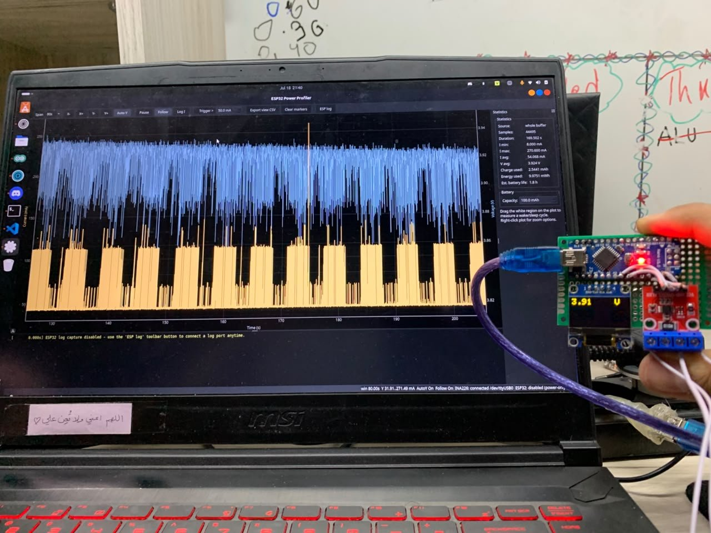
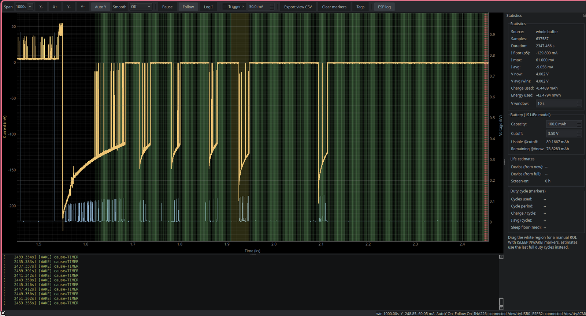

# Power Profiler

Dual-port power profiler for ESP32 deep-sleep optimization. It fuses two
serial streams on one timeline:

1. **INA226 current/voltage samples** from an Arduino (Nano) that streams
   `voltage,current` CSV lines (see `firmware/ina226_timed.ino`).
2. **ESP32-S3 debug log lines** from the project being profiled.

Log lines are drawn as red markers on the power graph at the exact time they
were received, so you can see *which firmware event caused which current
spike*.

<p align="center">
  <br>
  <sub>The sensor module next to the desktop app, mid-measurement.</sub>
</p>

## Hardware

<table>
  <tr>
    <td width="52%"></td>
    <td valign="top">
      <ul>
        <li><b>INA226</b> current/voltage sensor (I²C address <code>0x40</code>) with a 10&nbsp;mΩ shunt (<code>R010</code>) — the blue screw terminals are the in-line <code>INPUT</code> / <code>OUTPUT</code> the device under test is wired through</li>
        <li><b>Arduino Nano</b> reads the sensor and prints <code>voltage,current</code> lines over USB serial</li>
        <li><b>0.96″ SSD1306 OLED</b> (I²C <code>0x3C</code>, yellow / blue bands) shows live volts and mA, so the module doubles as a standalone meter</li>
      </ul>
      Sketch: <a href="firmware/ina226_timed.ino"><code>firmware/ina226_timed.ino</code></a>
    </td>
  </tr>
</table>

## Screenshots

Captured while profiling the watch firmware — the full history is in the project's
[Power Management](../documentation/power-management.md) notes.

<table>
  <tr>
    <td align="center"><br><sub><b>V1</b> · screen off, WiFi on — 51 mA average</sub></td>
    <td align="center"><br><sub><b>V1</b> · screen on, WiFi bursts — 90 mA average</sub></td>
  </tr>
  <tr>
    <td align="center"><br><sub><b>V1.22</b> · screen on at 80 MHz — 43 mA average</sub></td>
    <td align="center"><br><sub><b>V1.3</b> · light sleep — ~5 mA floor, screen-on stretch highlighted</sub></td>
  </tr>
  <tr>
    <td align="center" colspan="2"><br><sub><b>Charging</b> · current tapering off as the battery nears full, with <code>[WAKE]</code> markers from the ESP32 log</sub></td>
  </tr>
</table>

## Setup (Ubuntu)

```bash
cd power_profiler
python3 -m venv .venv
source .venv/bin/activate
pip install -r requirements.txt
```

Make sure your user can access serial ports (one-time, then re-login):

```bash
sudo usermod -aG dialout $USER
```

## Run

```bash
python profiler.py            # interactive port picker
python profiler.py --list     # show detected serial ports
python profiler.py --power /dev/ttyUSB0 --logs /dev/ttyACM0
python profiler.py --power /dev/ttyUSB0 --logs none   # power-only, no ESP32 logs
python profiler.py --demo     # synthetic data, no hardware needed
```

The ESP32 log stream is **optional**: choose `s` (skip) at the ESP32 port
prompt, or pass `--logs none`, to run in power-only mode. You can also
connect/disconnect it **at any time from the running UI** with the
`ESP log` toolbar button — plug the ESP32 in whenever you want log markers,
no restart needed. Reconnects append to the same `esp32_log.csv` (no
duplicate headers). If no log port is ever connected, that file is not
created.

## Features

- Real-time dual-axis plot: current (mA, left) + bus voltage (V, right).
- **Oscilloscope-style windowed view** (no shrinking trace as data flows):
  - `Span` — visible time window. Presets `2s/5s/10s/30s/60s/5min/All`, or
    type any value (`7s`, `12s`, `1.5m`, `5min`, `All`) + Enter.
  - `X-` / `X+` — halve / double the time window.
  - `Y-` / `Y+` — zoom the current axis (disables Auto Y).
  - `Auto Y` (default on) — fits Y to the **visible window only**, so
    history outside the window never flattens the deep-sleep floor.
  - `Follow` (default on) — slides the window to track the newest sample.
  - Mouse: **plain wheel = X zoom**, **Ctrl/Shift+wheel = Y zoom**,
    left-drag pan, right-drag box zoom, right-click for manual range.
  - Oscilloscope convention: any mouse pan/zoom disarms the matching auto
    behaviour (Follow / Auto Y) so your view sticks. Re-check to re-engage.
- **Display smoothing** — `Smooth` combo in toolbar (Off / Light / Medium / Heavy).
  Uses a time-windowed boxcar average on the visible data slice only; the
  underlying raw data and all statistics are never affected.
- ESP32 log overlay: vertical markers with the log text at that timestamp.
- ROI cursors: drag the white region to get min/max/avg current, charge
  (mAh/uAh) and energy (mWh/uWh) for just that wake/sleep cycle.
- **Marker tags** — print `[SLEEP]` / `[WAKE]` / `[SCREEN_ON]` etc. from the
  ESP32 and the profiler auto-detects duty cycles. Tags are configurable
  via `tags.toml` or the `Tags...` toolbar button (no code changes needed).
- **Battery model** — built-in piecewise-linear 1S LiPo V(SoC) curve with
  editable cutoff voltage (default 3.5 V — matches the ME6211C33 LDO
  headroom on the Waveshare board). Shows usable mAh, remaining mAh from
  the current voltage, and device life from now / from full / screen-on only.
- **Duty-cycle (marker) analysis** — when `[SLEEP]`/`[WAKE]` tags are present,
  the stats panel shows: cycle count, median cycle period, charge per cycle,
  average current per cycle, and a robust sleep-floor estimate (median across
  SLEEP intervals). Battery-life estimates use these steady-state cycles
  instead of the raw whole-buffer average.
- Linear/log current axis toggle (see deep-sleep floor and Wi-Fi spikes at
  the same time).
- Trigger mode: arm a current threshold; display recording starts only when
  current crosses it (CSV always records everything regardless).
- Status bar readout: current window width, Y range, Auto Y / Follow state.
- Auto-reconnect on USB unplug/replug.

## Data files

Everything is written continuously to `logs/<timestamp>/` (or `--outdir`):

- `power.csv` — `t_s, iso_time, voltage_v, current_ma`
- `esp32_log.csv` — `t_s, iso_time, line`

Both share the same `t_s` time base (`time.monotonic()` at startup), so the
two files can be joined externally for post-analysis. The **Export view CSV**
toolbar button additionally dumps just the currently visible window.

## Caveats

- Timestamps are PC receive time (~1-5 ms latency). Fine for sleep-cycle
  analysis; not for microsecond transients.
- INA226 resolution depends on calibration. `setMaxCurrentShunt(5.0, 0.01)`
  gives ~152 uA/count — too coarse to accurately measure a ~10-100 uA deep
  sleep floor. Recalibrate the sensor firmware (lower max current / larger
  shunt) if you need trustworthy sleep currents.
- The stock firmware prints as fast as `loop()` runs. `firmware/ina226_timed.ino`
  is an optional variant that samples at a steady 100 Hz for cleaner
  integration.

## Extending

- **ESP32 marker tags**: print tagged lines from your firmware:
  ```cpp
  Serial.println("[SLEEP] entering deep sleep");
  Serial.println("[WAKE] timer interrupt");
  Serial.println("[SCREEN_ON] refresh ui");
  Serial.println("[WIFI] tx burst");
  ```
  Tags are matched case-insensitively against `tags.toml` (auto-created on
  first run with sensible defaults). Edit the mapping in-code via the
  `Tags...` toolbar button, or by hand in the TOML file.
- The in-memory display buffer (`data_store.TimeSeriesBuffer`) is capped by
  RAM and doubles as needed; the CSV on disk is always the complete record.
